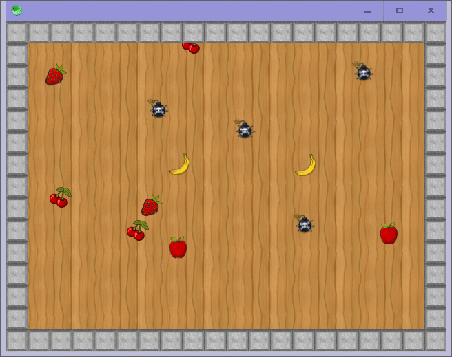

# JogoMaker

Attempt #2 at creating a game engine with [Sciter](https://sciter.com/), with love and care.

For Attempt #1, [see this project](https://github.com/GirkovArpa/SciterGamePOC), which was hastily thrown together as a proof of concept.

## Why "JogoMaker"?

Because GameMaker was already taken.  Plus, jogo looks like a fun word.  It's also Portuguese for game (I think).

## Where is this headed?

Hopefully to be a full-fledged game engine and editor ... only time will tell!

## How to run it?

Just plop [scapp](https://gitlab.com/sciter-engine/sciter-js-sdk/-/tree/main/bin) in this folder!

## Demo game

- Click fruits
- Avoid bombs
- Score is shown in window caption

